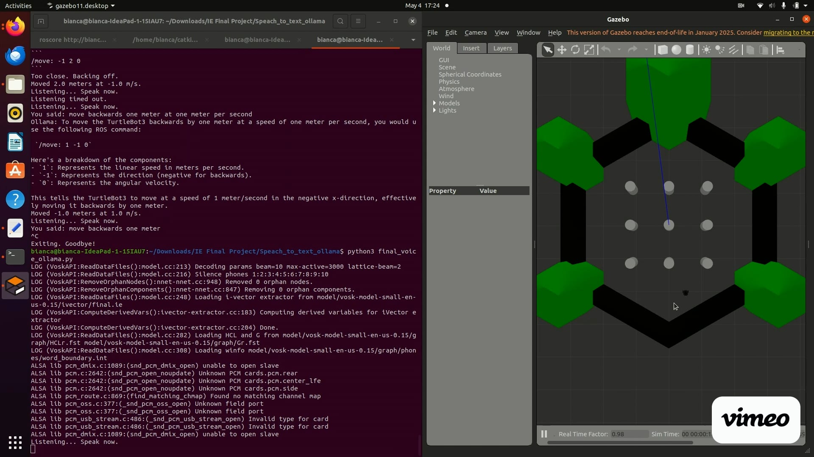
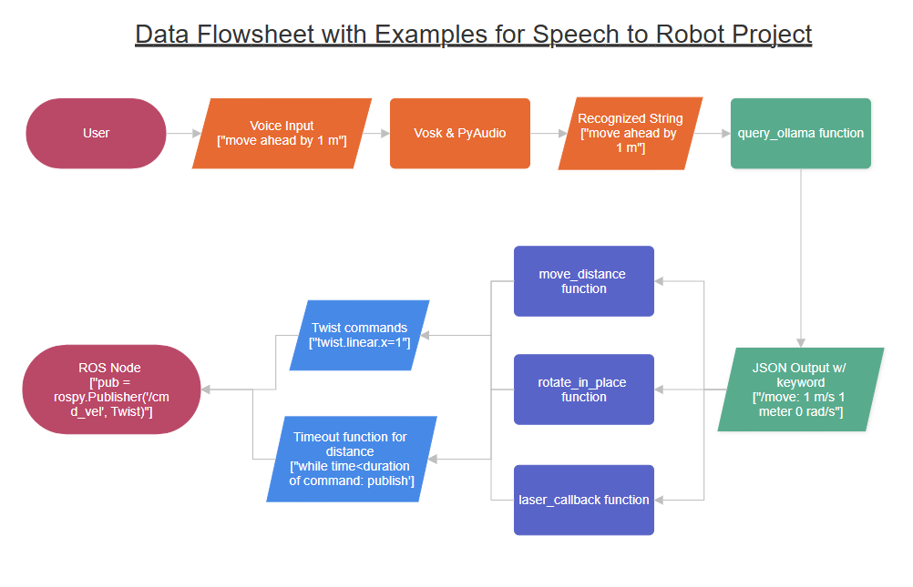

# Speech to Robot Commands
Bianca Burgess (biburges@buffalo.edu) & Piyush Salian (psalian@buffalo.edu)

## Motivation / Overview of your project.
#### Why did you choose this project? At a high level, what is your project about? Who should care about what you've done?
Modern day human robot interaction is severly dependent on the user's ability to utilize specific mediums for input. For example, manipulating robot motion via gazebo is predominately achieved via the passing of commands to the cmd/vel topic by keyboard input. This makes the method inaccessible to those who are differently abled. Birthed from this observation, our project hopes to address that inaccesibility by voice controlled robot manipulation. 

This is achieved by the recognition and analysis of voice commands, the parsing of the input through a LLM and ultimately the production of topic messages sent directly to a ROS node for robot manipulation. Steps taken to increase accessiblity include the choosing of specific voice recognition model that accomodate different accents and LLMs that account for the user's spread in technical knowledge regarding ROS topic messages. 

## Demonstration

See the video for demonstration

[](https://vimeo.com/1081331997/fba82ef947?ts=0&share=copy)

### Examples

**Example 1: Turning in Place 90 Degrees**

Voice Command: "Turn 90 degrees"

Ollama Output for ROS: `/rotate: 1 pi/2`

Results in Simulation: Rotate 1.57 radians counterclockwise at 1.57 rad/s

**Example 2: Move Forward 1 Meter**

Voice Command: "Move forward 1 meter"

Ollama Output for ROS: `move/: 1.0 1.0 1.0`

Results in Simulation: Moved 1.0 meters at 0.5 m/s

**Example 3: Move Backward 1 Meter**

Voice Command: "Move backward 1 meter"

Ollama Output for ROS: `move/: 1.0 -1.0 1.0`

Results in Simulation: Moved -1.0 meter at 0.5 m/s

## Visual Display of Data Flow through Functions


## The Assumptions Made by the Ollama LLM
This can be summarized by the context provided to the LLM via the prompt format given. The context provided to the LLM is as follows:

*"You are a ROS expert. Convert user commands into ONLY ROS TurtleBot3 motion commands in Python. Respond with:\n- `/move: speed distance angular` for linear movement,\n- `/rotate: angular_speed angle_in_radians` for turning in place.\nIf the command is 'stop', respond with `/cmd_vel: 0 0 0`. Use only **0.5 m/s** for linear speed and **1.5708 rad/s** for angular speed. Do not change these speeds. Use raw numeric values only. Do not include units like rad in the output."*

It can be assumed that the movements are exact with minute error arising from the LLM's use of publishing timeout to gauge distance 


## Installation Instructions

- Installing the portaudio development library
```
sudo apt update
sudo apt install portaudio19-dev python3-dev
```
- Install pyaudio on your machine
```
pip install pyaudio
```
- Install requests on your machine
```      
pip install requests
```
- Install pyttxs3 on your machine
```
pip install pyttsx3
```
- Download and Install VOSK on your machine
```    
pip3 install vosk
 ```
- Install Ollama Version 0.6.3 (https://ollama.com/download)
- Verify Installation via command line interfeace (windows command prompt)
```
ollama --version
```
The output produced should be (`ollama version is 0.6.3`)
- View any current ollama processes via:
```
tasklist | findstr /i "ollama"
```
- SKIP THIS STEP IF NOT APPLICABLE: Remove any processes that are active, where the PID is the code written before "CONSOLE" on the CLI:
```
taskkill /PID <PID> /F
```

## How to Run the Code (Linux)


#### Prerequisites 

Make sure the following are installed and working
- ROS 1
- TurtleBot3 Packages
- Gazebo
- Ollama running with llama3.2:latest
- Vosk

Additionally make sure you have the latest python script downloaded and placed into the ``IE Final Project/Speach_to_text_ollama`` folder

Now you will need about three terminals open

### Terminal 1

Launch TurtleBot3 Simualtion

```
export TURTLEBOT3_MODEL=burger
roslaunch turtlebot3_gazebo turtlebot3_world.launch
```
### Terminal 2

Start Ollama Server

```
ollama serve
```

Then, make sure your model is available

> Troubleshooting Tip: If running ollama serve produces an error like "Error: listen tcp ABC.0.0.1:XYZEF: bind: address already in use", run the following code
> ```
> sudo systemctl stop ollama
> ```

**If you are not able to run this in Terminal 2, open a new terminal**

```
ollama run llama3.2
```

If it's not pulled yet

```
ollama pull llama3.2
```

### Terminal 3

Change directories to the folder that has the python script and run the script

```
python3 final_voice_ollama.py
```

### While it's running

When the simulation is generated on your screen and the code is running, you can speak commands to it. You can say things such as "move forward" or "stop"

**See the  to see how to run it**


## References
Include links to websites you found helpful.
Also mention websites you tried but were not as helpful

- Build a Voice Assistant with Ollama: Speech-to-Text and TTS_ Episode 2
( https://www.youtube.com/watch?v=cMDHTXobwxk&list=PLuxh5fnYpxkGz7PnCX_HDE4XSMri9vp6K&index=5)
- Learn Ollama in 15 Minutes - Run LLM Models Locally for FREE
(https://www.youtube.com/watch?v=UtSSMs6ObqY)
- How to Install & Use Whisper AI Voice to Text
(https://www.youtube.com/watch?v=ABFqbY_rmEk&t=328s)
- Best FREE Speech to Text AI - Whisper AI
(https://www.youtube.com/watch?v=8SQV-B83tPU)


## Future Work
1) If you had more time, what would you do with this project?
2) Are there some bugs you need to fix? Please document where these are, what you've tried to do to fix them, and suggestions you have for how these could be fixed by someone else.
3) Are there new features you'd add? Please provide as many details as possible.

More time for this project would enable us to explore multiple features within the turtlebot simulator, which pushes forth our overall theme of technological accessiblity. Our current iteration includes the manipulation of robot velocity and orientation via the cmd/vel topic. However, there exist multiple other topics like /scan and /odom. Initializng a 2 way communication between ROS topics and the LLM (instead of the current one way) would allow the user to view topic inputs as well as dictate topic outputs. This manifests in dynamic interaction with the environment and the passing of prompts like "go towards the closest object). 

The addition of the autonomous waypoint navigation through the incorporation of slam gmapping. This would enable the user to simply pass waypoints that the robot moves towards, without the interacting with the cmd/vel topic. Users can then choose the features of the world they spawn in and pass commands to proceed towards or away from the landmarks. Also, we would like to include a way for the user change the speed through speech. Currently, we have it programmed so it will move at a velocity of 0.5 m/s and turn at a rate of 1.57 rad/s. We would like to continue to find a way to change the speed while the robot is moving.

A method to employ a more accurate manipulation of the robots motion can be achieved through the analysis of the /odom topic. As it currently stands, the prompting of the robot to "move forward by 4 meters" is satisfied by the passing of a velocity command and the subsequent timing out of the command after a set amount of time has been surpassed. For example, if the robot's velocity was 1 m/s and it was asked to move 4 meters, the robot would publish twist commands of linear.x=1 m/s for 4 seconds before timing out. However given the robot's current odometry, its xyz position and its Quaternion, the python script written can scan the /odom, extract the current coordinates and omit the use of the timeout function by simply analyzing whether the final position and initial position of the robot is 4 meters apart. 
